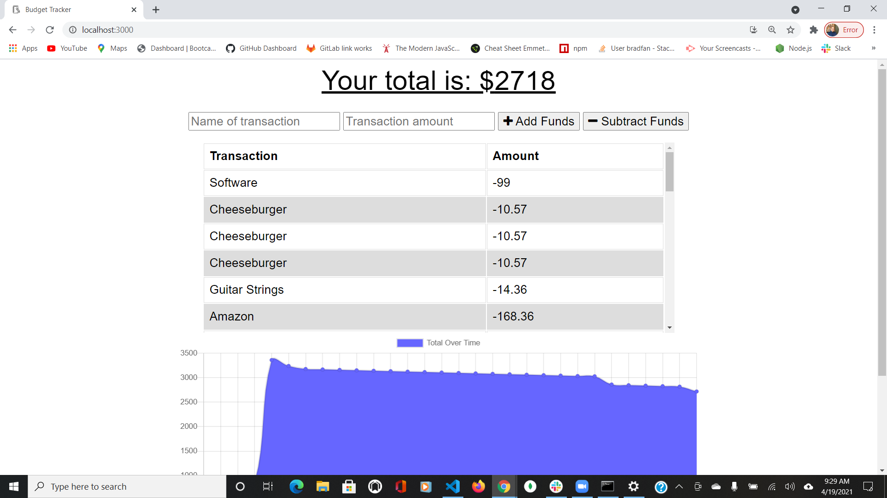

# Budget-Tracker

Github Repo link: https://github.com/bradfan/Budget-Tracker

Deployed Heroku Link: 

This Budget Tracker application allows the user to be able to track their withdrawals and deposits with or without a data/internet connection so that their account balance is accurate when they are traveling

The off line offline functionality:

* Allows the user to enter deposits offline

* Allows the user to enter expenses offline

When brought back online:

* Offline entries will be added to tracker.

Business Context:
Giving users a fast and easy way to track their money is important, but allowing them to access that information anytime is even more important. Having offline functionality is paramount to our applications success.

